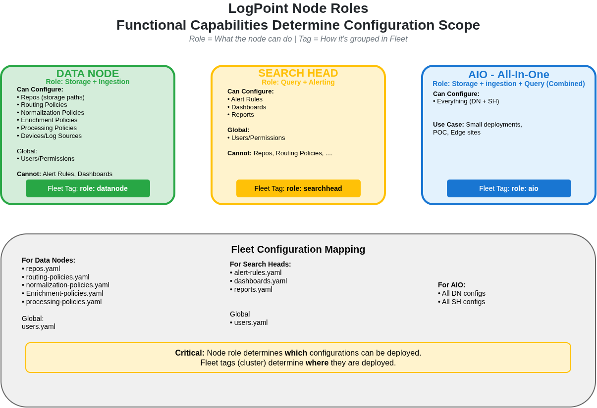
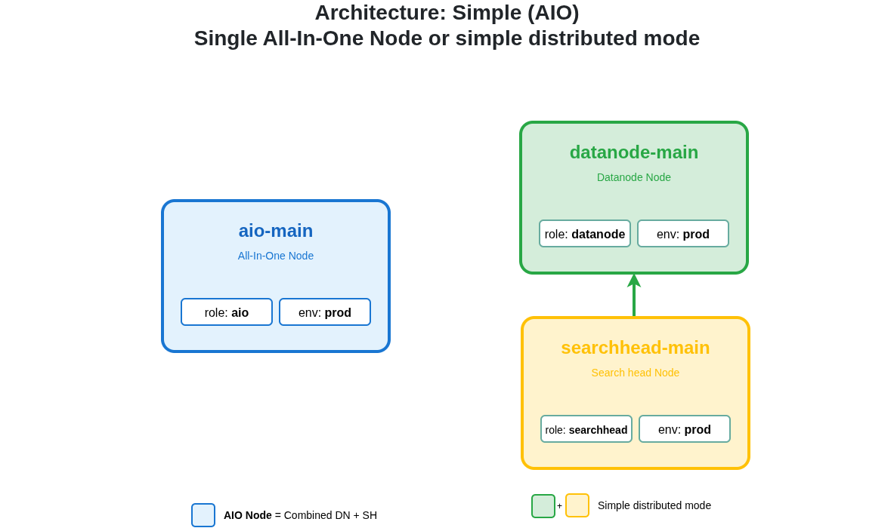
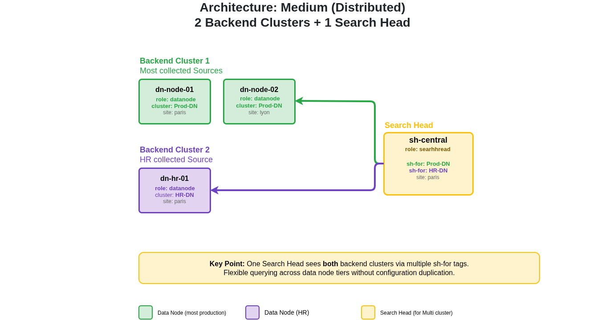
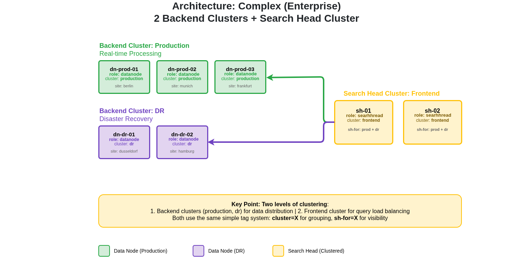
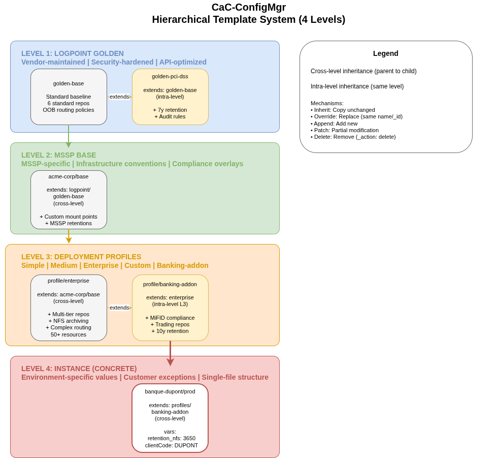
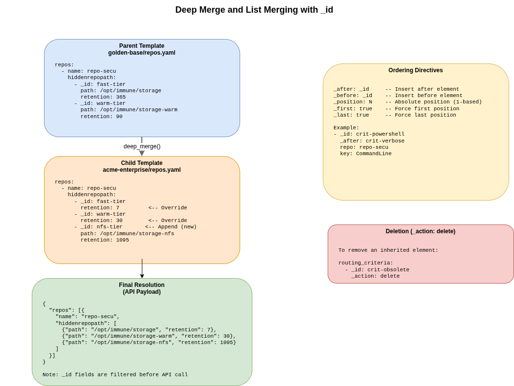

# CaC-ConfigMgr: Operating Mode & Context

> **Fleet & Hierarchical Templates Demonstration**  
> Centralized LogPoint Configuration Management in "Configuration as Code" Mode

---

## 🎯 Business Context

### The Problem

| Before | After with CaC |
|--------|----------------|
| 50+ SIEMs managed manually | 1 codebase = 50+ deployments |
| Frequent human errors | Automatic validation before deployment |
| No change traceability | Git = complete history |
| Client onboarding = 2 weeks | Onboarding = 1 YAML file |
| Mass update = nightmare | 1 template change → all clients |

### Our MSSP Architecture

```
┌──────────────────────────────────────────────────────────────┐
│                     LOGPOINT (Vendor)                        │
│         ┌─────────────────────────────────────┐              │
│         │      Golden Templates (Base)        │              │
│         │  • Security standards               │              │
│         │  • PCI-DSS, ISO27001 Compliance     │              │
│         └─────────────────┬───────────────────┘              │
└───────────────────────────┼──────────────────────────────────┘
                            │
                            ▼
┌──────────────────────────────────────────────────────────────┐
│                     ACME-CORP (MSSP)                         │
│         ┌─────────────────────────────────────┐              │
│         │    MSSP Base + Addons/Profiles      │              │
│         │  • Banking addon (MiFID)            │              │
│         │  • Healthcare addon (HIPAA)         │              │
│         │  • Profiles: simple/enterprise/...  │              │
│         └─────────────────┬───────────────────┘              │
└───────────────────────────┼──────────────────────────────────┘
                            │
                            ▼
┌─────────────────────────────────────────────────────────────┐
│                     CLIENTS (Instances)                     │
│    ┌──────────────┐  ┌──────────────┐  ┌──────────────┐     │
│    │   Bank A     │  │   Bank B     │  │   Corp X     │     │
│    │  (Premium)   │  │  (Standard)  │  │ (Enterprise) │     │
│    └──────────────┘  └──────────────┘  └──────────────┘     │
└─────────────────────────────────────────────────────────────┘
```

---

## 🏗️ Template Architecture (6 Levels)

### Vertical vs Horizontal Inheritance

```
┌─────────────────────────────────────────────────────────────────────┐
│                     TEMPLATE HIERARCHY                              │
├─────────────────────────────────────────────────────────────────────┤
│                                                                     │
│  LEVEL 1: LogPoint Golden Base      ← Root, LogPoint standard       │
│           │                                                         │
│           ├───[HORIZONTAL]──► LEVEL 2: PCI-DSS Addon                │
│           │                           (card payment compliance)     │
│           │                                                         │
│           └───[HORIZONTAL]──► LEVEL 2: ISO27001 Addon               │
│                                       (information security std)    │
│                                                                     │
│  LEVEL 3: MSSP Base ────────────────► extends PCI-DSS               │
│           │                           (VERTICAL inheritance)        │
│           │                                                         │
│           ├───[HORIZONTAL]──► LEVEL 4: Banking Addon                │
│           │                           (bank-specific)               │
│           │                                                         │
│           └───[HORIZONTAL]──► LEVEL 4: Healthcare Addon             │
│                                       (healthcare-specific)         │
│                                                                     │
│  LEVEL 5: Profiles ─────────────────► extend addons                 │
│           │                           (VERTICAL inheritance)        │
│           ├─── simple        (light client)                         │
│           ├─── enterprise    (standard client)                      │
│           └─── banking-premium (premium bank)                       │
│                                                                     │
│  LEVEL 6: Concrete Instance ────────► Specific client               │
│           │                           (VERTICAL inheritance)        │
│           └─── bank-a-prod   (code: BANKA, region: EU-WEST)         │
│                                                                     │
└─────────────────────────────────────────────────────────────────────┘
```

### Concrete Example: Bank A Production

```
Complete inheritance chain:

┌─────────┬────────────────────────┬───────────────────────────────────────┐
│ Level   │ Template               │ What it brings                        │
├─────────┼────────────────────────┼───────────────────────────────────────┤
│ 1       │ golden-base            │ • 6 standard repos                    │
│         │                        │ • Basic routing policies              │
│         │                        │ • Retention: 90 days                  │
├─────────┼────────────────────────┼───────────────────────────────────────┤
│ 2       │ golden-pci-dss         │ • +1 PCI-audit repo                   │
│ (addon) │                        │ • PCI retention: 7 years (2555d)      │
│         │                        │ • PCI processing policies             │
├─────────┼────────────────────────┼───────────────────────────────────────┤
│ 3       │ acme-base (MSSP)       │ • Override retention: 90→180d         │
│         │                        │ • Adds mount_warm, mount_cold         │
│         │                        │ • Archive tiering                     │
├─────────┼────────────────────────┼───────────────────────────────────────┤
│ 4       │ acme-banking-addon     │ • +1 trading repo                     │
│ (addon) │                        │ • Banking retention: 10 years         │
│         │                        │ • MiFID compliance                    │
├─────────┼────────────────────────┼───────────────────────────────────────┤
│ 5       │ acme-banking-premium   │ • MiFID enrichment                    │
│ (profil)│                        │ • Trading logs normalization          │
│         │                        │ • 4-tier storage (fast/warm/cold/nfs) │
├─────────┼────────────────────────┼───────────────────────────────────────┤
│ 6       │ bank-a-prod            │ • client_code: "BANKA"                │
│ (inst.) │                        │ • region: "EU-WEST"                   │
│         │                        │ • Specific repo-secu override         │
└─────────┴────────────────────────┴───────────────────────────────────────┘
```

---

## 🛰️ Fleet Concept (Fleet Management)

### Definition

A **Fleet** = a group of LogPoint nodes (DataNodes, SearchHeads, AIOS) sharing the same configuration.

```yaml
# Fleet Bank A
spec:
  managementMode: director    # Managed via Director API
  director:
    poolUuid: pool-bank-a     # Isolated pool for the client
    apiHost: https://director.logpoint.com
  
  nodes:
    dataNodes:                # Log storage
      - name: dn-bank-a-01
        logpointId: lp-bank-a-p1
        tags: [cluster: production, env: prod, region: eu-west-1]
      - name: dn-bank-a-02
        logpointId: lp-bank-a-p2
    
    searchHeads:              # Search interface
      - name: sh-bank-a-01
        logpointId: lp-bank-a-s1
        tags: [cluster: frontend, env: prod]
```

### Node Types

| Type | Role | Example tags |
|------|------|--------------|
| **DataNode** | Storage and indexing | `cluster: production`, `retention: hot` |
| **SearchHead** | User interface | `cluster: frontend`, `role: primary` |
| **AIOS** | Analytics and ML | `cluster: analytics`, `gpu: enabled` |

---

## ⚙️ Operating Mode

### "Desired State" Workflow

```
┌──────────────┐     ┌──────────────┐     ┌──────────────┐     ┌──────────────┐
│   YAML des   │────▶│   Template   │────▶│  Comparison  │────▶│  Application │
│   configs    │     │  Resolution  │     │ (plan/diff)  │     │   (apply)    │
└──────────────┘     └──────────────┘     └──────────────┘     └──────────────┘
       │                    │                    │                    │
       ▼                    ▼                    ▼                    ▼
   SIEM Team           6-level             See the              Automatic
   writes YAML         inheritance         changes              deployment
```

### Main Commands

```bash
# 1. VALIDATE - Check syntax and consistency
cac-configmgr validate demo-configs/
# → Check: YAML syntax, references, schemas

# 2. PLAN - Preview changes before applying
cac-configmgr plan \
  --fleet demo-configs/instances/banks/bank-a/prod/fleet.yaml
  --topology demo-configs/instances/banks/bank-a/prod/instance.yaml   
  --templates-dir demo-configs/templates   
  --export-dir demo-configs/.desired-state/
# → Displays: resolved resources, variables, inheritance chain

# 3. APPLY - Deploy (when we reach Phase 2+)
# cac-configmgr apply --fleet ... --topology ... --auto-approve
```

### Client Configuration Example

```yaml
# instances/banks/bank-a/prod/instance.yaml
apiVersion: cac-configmgr.io/v1
kind: TopologyInstance
metadata:
  name: bank-a-prod
  extends: mssp/acme-corp/profiles/banking-premium  # ← Inherits premium profile
  fleetRef: ./fleet.yaml                             # ← References fleet

spec:
  vars:
    client_code: BANKA        # ← Client-specific variable
    region: EU-WEST           # ← Client-specific variable
  
  # Specific overrides (optional)
  repos:
    - name: repo-secu
      hiddenrepopath:
        - _id: nfs-tier
          retention: 3650     # ← Override: 10 years for this client
```

---

## 🔄 Comparison: Bank A vs Bank B vs Corp X

### Same MSSP, Different Profiles

```
┌─────────────────────────────────────────────────────────────────────────┐
│                          BANK A                                         │
│  ┌─────────────────────────────────────────────────────────────────┐    │
│  │ Profile: banking-premium                                        │    │
│  │ Chain: base → pci-dss → mssp-base → banking → banking-premium   │    │
│  │                                                                 │    │
│  │ • 10 repos (incl. trading, pci-audit)                           │    │
│  │ • MiFID enrichment                                              │    │
│  │ • Max retention: 10 years                                       │    │
│  │ • Variables: client_code=BANKA, region=EU-WEST                  │    │
│  └─────────────────────────────────────────────────────────────────┘    │
└─────────────────────────────────────────────────────────────────────────┘

┌─────────────────────────────────────────────────────────────────────────┐
│                          BANK B                                         │
│  ┌─────────────────────────────────────────────────────────────────┐    │
│  │ Profile: banking (direct addon)                                 │    │
│  │ Chain: base → pci-dss → mssp-base → banking                     │    │
│  │                                                                 │    │
│  │ • 8 repos (no trading, no nfs-tier)                             │    │
│  │ • No MiFID enrichment                                           │    │
│  │ • Max retention: 7 years (PCI)                                  │    │
│  │ • Variables: client_code=BANKB, region=EU-EAST                  │    │
│  └─────────────────────────────────────────────────────────────────┘    │
└─────────────────────────────────────────────────────────────────────────┘

┌─────────────────────────────────────────────────────────────────────────┐
│                          CORP X (Enterprise)                            │
│  ┌─────────────────────────────────────────────────────────────────┐    │
│  │ Profile: enterprise                                             │    │
│  │ Chain: base → pci-dss → mssp-base → enterprise                  │    │
│  │                                                                 │    │
│  │ • 7 repos (standard + archive tiers)                            │    │
│  │ • No banking-specific                                           │    │
│  │ • Max retention: 7 years                                        │    │
│  │ • Variables: client_code=CORPX, region=US-EAST                  │    │
│  └─────────────────────────────────────────────────────────────────┘    │
└─────────────────────────────────────────────────────────────────────────┘
```

---

## ✅ Key Benefits

### 1. **DRY Principle** (Don't Repeat Yourself)
```
❌ Before: 50 clients × 100 config lines = 5000 lines to maintain
✅ After: 6 templates + 50 instance files = ~800 lines only
```

### 2. **Simplified Mass Updates**
```bash
# Modify retention_default in acme-base
# → Impact: ALL ACME clients are automatically updated
```

### 3. **Fast Onboarding**
```bash
# New client = 1 YAML file
# Time: 5 minutes vs 2 weeks before
```

### 4. **Guaranteed Compliance**
```
PCI-DSS Addon → all banking clients inherit
ISO27001 Addon → all sensitive clients inherit
```

### 5. **Audit and Traceability**
```
Git log = complete change history
Who changed what when = immediately available
```

---

## 📋 Demo Checklist

| Step | Command/Action | Objective |
|------|----------------|-----------|
| 1 | `tree demo-configs/ -L 4` | Show complete structure |
| 2 | `cac-configmgr validate demo-configs/` | Validate all configs |
| 3 | Plan Bank A | Show resolution + 6-level chain |
| 4 | Compare Bank A vs Bank B | Show profile flexibility |
| 5 | Show fleet.yaml | Explain fleet management |
| 6 | Highlight variables | client_code, region, retentions |

---

## 🎤 Key Messages to Communicate

1. **"One codebase to manage 1 or 100 SIEMs with the same effort"**

2. **"6-level inheritance allows factoring 80% of the configuration"**

3. **"Validation before deployment = zero errors in production"**

4. **"Client onboarding in minutes, not weeks"**

5. **"Compliance by construction, not by verification"**

---

## 📎 Visual Diagrams

All diagrams are available in `docs/Presentations/TemplateHierarchy-Fleet/images/`.

### Fleet Architecture (01-fleet-architecture.drawio)

**Page 1: Node Roles**  
*DataNode, SearchHead, AIO capabilities and fleet tags*  


**Page 2: Simple Architecture**  
*Single AIO or simple distributed mode*  


**Page 3: Medium Distributed**  
*2 backend clusters + 1 Search Head*  


**Page 4: Complex Enterprise**  
*Production cluster + DR + SH cluster*  


---

### Template Hierarchy (02-template-hierarchy.drawio)

**Page 1: 4-Level Overview**  
*Hierarchical template system (4 levels)*  


**Page 2: Merge Mechanisms**  
*Deep merge with `_id` matching*  


**Page 3: Complete Example**  
*Full repo inheritance chain*  


---

### Export Instructions

If you need to re-export from draw.io:

**Files to open:**
- `docs/Presentations/TemplateHierarchy-Fleet/schemas/01-fleet-architecture.drawio`
- `docs/Presentations/TemplateHierarchy-Fleet/schemas/02-template-hierarchy.drawio`

**Export settings:**
- Format: PNG
- Border: 10px
- Crop: Crop to Content
- Save to: `docs/Presentations/TemplateHierarchy-Fleet/images/`

---

*Document prepared for CaC-ConfigMgr demonstration*  
*Phase 1: Foundation (Template Resolution) | Phase 2: Director Integration (Plan/Apply)*
