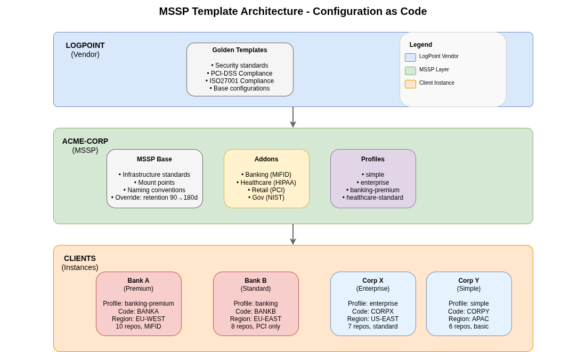
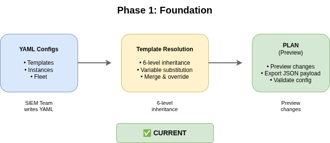
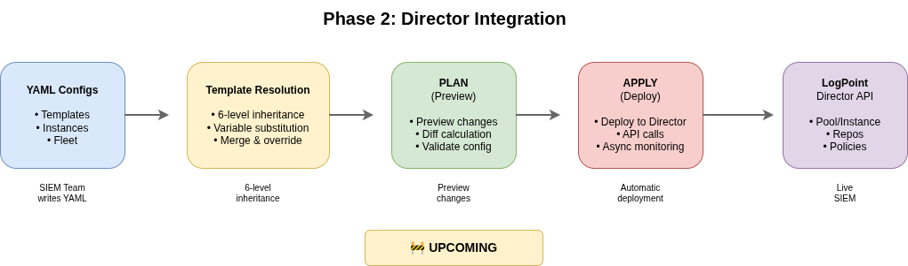
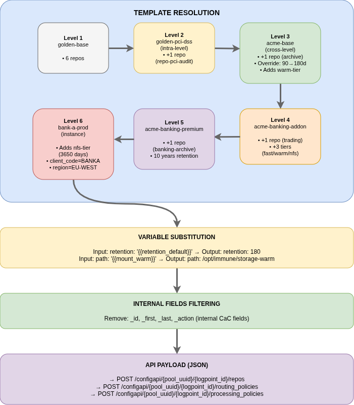

# Hierarchical Templates and Fleet Management

> **CaC-ConfigMgr** - Centralized LogPoint Configuration Management  
> *Configuration as Code for LogPoint SIEM*

---

## 📋 Table of Contents

1. [Context & Challenges](#1-context--challenges)
2. [Key Concepts](#2-key-concepts)
   - Template Hierarchy (6 levels)
   - Fleet Management
3. [Template Architecture](#3-template-architecture)
4. [Fleet Management](#4-fleet-management)
5. [Demo - Operating Mode](#5-demo---operating-mode)
6. [Key Benefits](#6-key-benefits)

---

## 1. Context & Challenges

### The Problem Before CaC

| Before | After with CaC |
|--------|----------------|
| 50+ SIEMs managed manually | 1 codebase = 50+ deployments |
| Frequent human errors | Automatic validation before deployment |
| No change traceability | Git = complete history |
| Client onboarding = 2 weeks | Onboarding = 1 YAML file |
| Mass update = nightmare | 1 template change → all clients |

### Our Template MSSP Architecture



---

## 2. Key Concepts

### 2.1 Template Hierarchy (6 Levels)

Multi-level inheritance system enabling reuse and progressive specialization of configurations.


### 2.2 Fleet Management

A **Fleet** = a group of LogPoint nodes (DataNodes, SearchHeads, AIOS) sharing the same configuration.

```yaml
apiVersion: cac-configmgr.io/v1
kind: Fleet
metadata:
  name: bank-a
spec:
  managementMode: director
  director:
    poolUuid: pool-bank-a
    apiHost: https://director.logpoint.com
    credentialsRef: env://DIRECTOR_TOKEN
  nodes:
    aios: []
    dataNodes:
    # Production cluster with 2 DataNodes
    - name: dn-bank-a-01
      logpointId: lp-bank-a-p1
      tags:
      - cluster: production
      - env: prod
      - region: eu-west-1
    - name: dn-bank-a-02
      logpointId: lp-bank-a-p2
      tags:
      - cluster: production
      - env: prod
      - region: eu-west-1
    searchHeads:
    # Search Head sees the production cluster
    - name: sh-bank-a-01
      logpointId: lp-bank-a-s1
      tags:
      - cluster: frontend
      - env: prod
      - sh-for: production
```

---

## 3. Template Architecture

### 3.1 Vertical vs Horizontal Inheritance

| Type | Direction | Description | Example |
|------|-----------|-------------|---------|
| **Cross-Level** (Vertical) | N-1 → N | Standard parent→child inheritance | `mssp-base` extends `golden-base` |
| **Intra-Level** (Horizontal) | N → N | Same level, specialized add-ons | `banking-addon` extends `enterprise` |

### 3.2 Concrete simplify example


**Summary from our demo data**:

| Level | Template | What it brings |
|-------|----------|----------------|
| 1 | golden-base | • 6 standard repos<br>• Basic routing policies<br>• Retention: 90 days |
| 2 (addon) | golden-pci-dss | • +1 PCI-audit repo<br>• PCI retention: 7 years (2555d)<br>• PCI processing policies |
| 3 | acme-base (MSSP) | • Override retention: 90→180d<br>• Adds mount_warm, mount_cold<br>• Archive tiering |
| 4 (addon) | acme-banking-addon | • +1 trading repo<br>• Banking retention: 10 years<br>• MiFID compliance |
| 5 (profile) | acme-banking-premium | • MiFID enrichment<br>• Trading logs normalization<br>• 4-tier storage (fast/warm/cold/nfs) |
| 6 (instance) | bank-a-prod | • client_code: "BANKA"<br>• region: "EU-WEST"<br>• Specific repo-secu override |

### 3.3 Inheritance Mechanisms

| Mechanism | Description | Use Case |
|-----------|-------------|----------|
| **Inherit** | Copy all resources from parent unchanged | Standard compliance baselines |
| **Override** | Replace resource with same identifier | Change retention, modify paths |
| **Append** | Add new resources not in parent | Additional repos, custom policies |
| **Patch** | Partial modification of parent resource | Add a routing criteria, extend list |
| **Delete** | Remove resource from parent (explicit) | Disable default repo for specific case |

### 3.4 Resource Identification & Merging

Top-level resources are identified by their **kind + name** tuple:

```yaml
kind: RepoConfig
name: repo-secu  # ← Unique identifier for inheritance
```

For **lists** (e.g., `hiddenrepopath`, `routing_criteria`), elements are matched using **_id**:

```yaml
repos:
  - name: repo-secu
    hiddenrepopath:
      - _id: fast-tier        # ← Template ID (internal, not sent to API)
        path: /opt/immune/storage
        retention: 30
        
      - _id: warm-tier        # ← Template ID for second element
        path: /opt/immune/storage-warm
        retention: 90
```

**Matching Rules:**
| Scenario | Result |
|----------|--------|
| Same `_id` in parent and child | **Merge**: Child fields override parent, undefined fields inherited |
| `_id` only in parent | **Inherit**: Element kept as-is |
| `_id` only in child | **Append**: New element added to list |
| `_action: delete` on existing `_id` | **Remove**: Element removed from list |

> **Important**: `_id` and `_action` fields are **internal to CaC-ConfigMgr** and are **filtered out** before sending to LogPoint API.

### 3.5 Merge Mechanisms


### 3.6 Ordering Directives

When merging lists (especially for **normalization policies**), element order matters critically. If a generic package is placed before a specific one, the log will be matched by the generic parser and the specific one will never be reached.

| Directive | Description | Example |
|-----------|-------------|---------|
| `_first: true` | Insert at the beginning of the list | Insert specific parsers first |
| `_last: true` | Insert at the end of the list | Append generic fallback parsers |
| `_position: N` | Insert at absolute position N | Fixed position requirement |
| `_after: element_id` | Insert after a specific element | Add after existing package |
| `_before: element_id` | Insert before a specific element | Add before existing package |

#### Example: Normalization Policy Ordering

```yaml
# Level 1: Parent template defines base normalization
normalizationPolicies:
  - name: np-auto
    normalization_packages:
      - _id: pkg-autoparser
        name: AutoParser  # ← Generic parser (catches everything)

# Level 3: MSSP adds specific Windows parsing
normalizationPolicies:
  - name: np-windows
    normalization_packages:
      - _id: pkg-windows
        name: Windows
        _before: pkg-autoparser   # ← MUST be before AutoParser!
      - _id: pkg-winsec
        name: WinSecurity
        _before: pkg-autoparser   # ← MUST be before AutoParser!
```

**Why Order Matters:**

```
❌ WRONG ORDER (generic first):
1. AutoParser (generic) → Matches ALL logs, including Windows
2. Windows (specific)   → NEVER REACHED!
3. WinSecurity          → NEVER REACHED!

✅ CORRECT ORDER (specific first):
1. Windows (specific)   ← Windows logs matched here
2. WinSecurity          ← Windows security events matched here  
3. AutoParser (generic) ← Everything else falls back here
```

#### Example: Banking-specific SWIFT Parser

```yaml
# Level 4: Banking addon adds SWIFT financial messaging
normalizationPolicies:
  - name: np-banking
    normalization_packages:
      - _id: pkg-swift
        name: SWIFT
        _first: true   # ← SWIFT messages MUST be parsed first
      - _id: pkg-sepa
        name: SEPA
        _first: true   # ← SEPA messages MUST be parsed first
```

**Final Order After Merge:**
```
np-banking normalization_packages:
1. SWIFT    ← _first: true
2. SEPA     ← _first: true  
3. Windows  ← from parent
4. WinSecurity ← from parent
5. AutoParser  ← from parent
```

#### Precedence Rules

When multiple ordering directives conflict, the following precedence applies:

1. **`_action: delete`** - Remove element (highest priority)
2. **`_position: N`** - Absolute positioning
3. **`_first: true` / `_last: true`** - Relative positioning
4. **`_after` / `_before`** - Relative to other elements

> **Note**: Ordering directives are **internal to CaC-ConfigMgr** and are filtered out before API calls, like `_id` fields.

---

## 4. Fleet Management

### 4.1 Node Types

| Type | Role | Example tags |
|------|------|--------------|
| **DataNode** | Storage and indexing | `cluster: production`, `env: prod`, `region: eu-west-1` |
| **SearchHead** | User interface | `cluster: frontend`, `env: prod`, `sh-for: production` |
| **AIOS** | All-in-One (combined DN+SH) | `cluster: dr-site`, `env: prod` |

### 4.2 Supported Topologies

#### Standalone Mode (All-in-One or simple distributed mode)


#### Medium Simple Distributed Mode


#### Distributed with Clustering


### 4.3 Cluster Prerequisites

> **⚠️ Important**: To push identical configurations to a cluster of nodes, the following requirements must be met:

| Requirement | Description |
|-------------|-------------|
| **SIEM Version** | All nodes in the cluster must run the **same LogPoint version** (e.g., 7.6, 7.7) |
| **Plugin List** | All nodes must have the **identical list of plugins** installed |
| **Plugin Versions** | Each plugin must be the **same version** across all nodes |

**Why this matters:**
- Version mismatch can cause configuration deployment failures
- Missing plugins on one node will result in invalid configuration states
- The CaC tool validates these prerequisites before deployment

### 4.4 Tag System

Tags define relationships between nodes:

```yaml
# Cluster Membership
dn-prod-01: tags: [cluster: production]
dn-prod-02: tags: [cluster: production]  # Same cluster

# SH to DN Relationships  
sh-prod-01:
  tags:
    - cluster: sh-frontend
    - sh-for: production   # ← See all DNs with cluster: production
```

| Tag on SH | Meaning |
|-----------|---------|
| `sh-for: production` | Sees all DNs with `cluster: production` |
| `sh-for: legacy` | Sees all DNs with `site: legacy` |
| No `sh-for` tag | Sees nothing (or everything if admin) |

### 4.5 Node Roles


---

## 5. Demo - Operating Mode

### 5.1 "Desired State" Workflow

**Phase 1 (Current): Foundation**



**Phase 2 (Upcoming): Director Integration**



### 5.2 Main Commands (Phase 1)

```bash
# 1. VALIDATE - Check syntax and consistency
cac-configmgr validate demo-configs/
# → Check: YAML syntax, references, schemas

# 2. PLAN - Preview changes (generates desired state)
cac-configmgr plan \
  --fleet demo-configs/instances/banks/bank-a/prod/fleet.yaml \
  --topology demo-configs/instances/banks/bank-a/prod/instance.yaml \
  --templates-dir demo-configs/templates \
  --export-dir demo-configs/.desired-state/
# → Displays: resolved resources, variables, inheritance chain
# → Exports: JSON payload ready for API (Phase 2)
```

**Phase 2 Commands (Upcoming):**
```bash
# 3. APPLY - Deploy to Director/SIEM
cac-configmgr apply \
  --fleet demo-configs/instances/banks/bank-a/prod/fleet.yaml \
  --topology demo-configs/instances/banks/bank-a/prod/instance.yaml \
  --auto-approve
# → Deploys: Configuration to LogPoint via Director API
```

### 5.3 Client Configuration Example

Below is a minimal instance configuration. See the [Appendix](#appendix-complete-bank-a-example) for the complete hierarchy (Levels 1-6) and fleet configuration with clustered DataNodes.

```yaml
# instances/banks/bank-a/prod/instance.yaml
apiVersion: cac-configmgr.io/v1
kind: TopologyInstance
metadata:
  name: bank-a-prod
  extends: mssp/acme-corp/profiles/banking-premium  # ← Inherits premium profile
  fleetRef: ./fleet.yaml                             # ← References fleet

spec:
  vars:
    client_code: BANKA        # ← Client-specific variable
    region: EU-WEST           # ← Client-specific variable
  
  # Specific overrides (optional)
  repos:
    - name: repo-secu
      hiddenrepopath:
        - _id: nfs-tier
          retention: 3650     # ← Override: 10 years for this client
```

---

## 6. Key Benefits

### 6.1 DRY Principle (Don't Repeat Yourself)

```
❌ Before: 50 clients × 100 config lines = 5000 lines to maintain
✅ After: 6 templates + 50 instance files = ~800 lines only
```

### 6.2 Simplified Mass Updates

```bash
# Modify retention_default in acme-base
# → Impact: ALL ACME clients are automatically updated
```

### 6.3 Fast Configuration Onboarding

```bash
# New client configuration = 1 YAML file
# Configuration time: from week(s) to hour(s)
# (Machine provisioning time remains unchanged)
```

### 6.4 Guaranteed Compliance

```
PCI-DSS Addon → all banking clients inherit
ISO27001 Addon → all sensitive clients inherit
```

### 6.5 Audit and Traceability

```
Git log = complete change history
Who changed what when = immediately available
```

---

## 🎤 Key Messages to Communicate

1. **"One codebase to manage 1 or 100 SIEMs with the same effort"**

2. **"6-level inheritance allows factoring up to 90% of the configuration (based on client complexity)"**

3. **"Validation before deployment = zero errors in production"**

4. **"Client onboarding in hours, not weeks"**

5. **"Compliance by construction, not by verification"**

---

## 📎 Available Diagrams

All diagrams are located in `docs/Presentations/TemplateHierarchy-Fleet/images/`:

| Diagram | File | Description |
|---------|------|-------------|
| Node Roles | `01-node-roles.png` | DataNode, SearchHead, AIO capabilities and fleet tags |
| Simple Architecture | `02-simple-arch.png` | Single AIO or simple distributed mode |
| MSSP Architecture | `03-mssp-architecture.png` | 3-tier MSSP architecture (Vendor → MSSP → Clients) |
| Medium Distributed | `03-medium-dist.png` | 2 backend clusters + 1 Search Head |
| Complex Enterprise | `04-complex-ent.png` | Production cluster + DR + SH cluster |
| Workflow Phase 1 | `04-workflow-phase1.png` | Phase 1: Foundation workflow (YAML → Resolution → Plan) |
| Workflow Phase 2 | `04-workflow-phase2.png` | Phase 2: Director Integration workflow (+ Apply) |
| Deployment Flow | `05-deployment-flow.png` | Complete deployment pipeline (Resolution → Substitution → Filtering → API) |
| 4-Level Overview | `05-4level-overview.png` | Hierarchical template system overview |
| Merge Mechanisms | `06-merge-mechanisms.png` | Deep merge with `_id` matching |
| Complete Example | `07-complete-example.png` | Full repo inheritance chain |

---

## 📚 References

| Document | Description |
|----------|-------------|
| `specs/20-TEMPLATE-HIERARCHY.md` | Complete template hierarchy specification |
| `specs/10-INVENTORY-FLEET.md` | Fleet Inventory specification |
| `docs/DEMO-OPERATING-MODE.md` | Complete demo guide |
| `examples/` | Configuration examples |

---

## Appendix: Complete Bank A Example

This section provides a complete, concrete example of the Bank A production configuration, showing all inheritance levels from Golden Base to the final API payload.

### Inheritance Chain Overview

```
bank-a-prod (Level 6)
└── extends: acme-banking-premium (Level 5)
    └── extends: acme-banking-addon (Level 4)
        └── extends: acme-base (Level 3)
            └── extends: golden-pci-dss (Level 2)
                └── extends: golden-base (Level 1)
```

---

### Level 1: LogPoint Golden Base

**File:** `templates/logpoint/golden-base/repos.yaml`

```yaml
apiVersion: cac-configmgr.io/v1
kind: ConfigTemplate
metadata:
  name: golden-base
  version: 2.0.0
  provider: logpoint
spec:
  repos:
  - name: repo-default
    hiddenrepopath:
    - _id: primary
      path: '{{mount_point}}'
      retention: '{{retention_default}}'
  - name: repo-secu
    hiddenrepopath:
    - _id: primary
      path: '{{mount_point}}'
      retention: '{{retention_sec}}'
  - name: repo-secu-verbose
    hiddenrepopath:
    - _id: primary
      path: '{{mount_point}}'
      retention: 30
  - name: repo-system
    hiddenrepopath:
    - _id: primary
      path: '{{mount_point}}'
      retention: 180
  - name: repo-system-verbose
    hiddenrepopath:
    - _id: primary
      path: '{{mount_point}}'
      retention: 30
  - name: repo-cloud
    hiddenrepopath:
    - _id: primary
      path: '{{mount_point}}'
      retention: 180
```

**Variables:** `templates/logpoint/golden-base/vars.yaml`

```yaml
apiVersion: cac-configmgr.io/v1
kind: ConfigTemplate
metadata:
  name: golden-base
spec:
  vars:
    mount_point: /opt/immune/storage
    retention_default: 90
    retention_sec: 365
```

---

### Level 2: PCI-DSS Addon (Intra-level)

**File:** `templates/logpoint/golden-pci-dss/repos.yaml`

```yaml
apiVersion: cac-configmgr.io/v1
kind: ConfigTemplate
metadata:
  name: golden-pci-dss
  extends: logpoint/golden-base
  version: 1.0.0
  provider: logpoint
spec:
  repos:
  - name: repo-pci-audit
    hiddenrepopath:
    - _id: primary
      path: /opt/immune/storage-nfs
      retention: '{{retention_pci}}'
```

**Variables:** `templates/logpoint/golden-pci-dss/vars.yaml`

```yaml
apiVersion: cac-configmgr.io/v1
kind: ConfigTemplate
metadata:
  name: golden-pci-dss
  extends: logpoint/golden-base
spec:
  vars:
    retention_pci: 2555  # 7 years PCI requirement
```

---

### Level 3: MSSP Base (ACME Corp)

**File:** `templates/mssp/acme-corp/base/repos.yaml`

```yaml
apiVersion: cac-configmgr.io/v1
kind: ConfigTemplate
metadata:
  name: acme-base
  extends: logpoint/golden-pci-dss
  version: 1.0.0
  provider: acme-mssp
spec:
  repos:
  - name: repo-secu
    hiddenrepopath:
    - _id: primary
      retention: 90  # Override from parent
    - _id: warm-tier
      path: '{{mount_warm}}'
      retention: 365
  - name: repo-archive
    hiddenrepopath:
    - _id: warm-tier
      path: '{{mount_warm}}'
      retention: 90
    - _id: cold-tier
      path: '{{mount_cold}}'
      retention: 1095
```

**Variables:** `templates/mssp/acme-corp/base/vars.yaml`

```yaml
apiVersion: cac-configmgr.io/v1
kind: ConfigTemplate
metadata:
  name: acme-base
  extends: logpoint/golden-pci-dss
spec:
  vars:
    retention_default: 180  # Override: 90→180
    mount_warm: /opt/immune/storage-warm
    mount_cold: /opt/immune/storage-cold
```

---

### Level 4: Banking Addon (Intra-level)

**File:** `templates/mssp/acme-corp/addons/banking/repos.yaml`

```yaml
apiVersion: cac-configmgr.io/v1
kind: ConfigTemplate
metadata:
  name: acme-banking-addon
  extends: mssp/acme-corp/base
  version: 1.0.0
  provider: acme-mssp
spec:
  repos:
  - name: repo-trading
    hiddenrepopath:
    - _id: primary
      path: '{{mount_point}}'
      retention: 1
    - _id: warm-tier
      path: '{{mount_warm}}'
      retention: 7
    - _id: nfs-tier
      path: /opt/immune/storage-nfs
      retention: 2555
```

**Variables:** `templates/mssp/acme-corp/addons/banking/vars.yaml`

```yaml
apiVersion: cac-configmgr.io/v1
kind: ConfigTemplate
metadata:
  name: acme-banking-addon
  extends: mssp/acme-corp/base
spec:
  vars:
    retention_banking: 3650  # 10 years MiFID
```

---

### Level 5: Banking Premium Profile

**File:** `templates/mssp/acme-corp/profiles/banking-premium/repos.yaml`

```yaml
apiVersion: cac-configmgr.io/v1
kind: ConfigTemplate
metadata:
  name: acme-banking-premium
  extends: mssp/acme-corp/addons/banking
  version: 1.0.0
  provider: acme-mssp
spec:
  repos:
  - name: repo-banking-archive
    hiddenrepopath:
    - _id: primary
      path: /opt/immune/storage-nfs
      retention: 3650
```

**Variables:** `templates/mssp/acme-corp/profiles/banking-premium/vars.yaml`

```yaml
apiVersion: cac-configmgr.io/v1
kind: ConfigTemplate
metadata:
  name: acme-banking-premium
  extends: mssp/acme-corp/addons/banking
spec:
  vars:
    compliance: mifid-banking
```

---

### Level 6: Bank A Production Instance

**File:** `instances/banks/bank-a/prod/instance.yaml`

```yaml
apiVersion: cac-configmgr.io/v1
kind: TopologyInstance
metadata:
  name: bank-a-prod
  extends: mssp/acme-corp/profiles/banking-premium
  fleetRef: ./fleet.yaml
spec:
  vars:
    client_code: BANKA
    region: EU-WEST
  repos:
  - name: repo-secu
    hiddenrepopath:
    - _id: nfs-tier        # Adding new tier
      path: /opt/immune/storage-nfs
      retention: 3650      # 10 years for this client
```

---

### Fleet Configuration

**File:** `instances/banks/bank-a/prod/fleet.yaml`

```yaml
apiVersion: cac-configmgr.io/v1
kind: Fleet
metadata:
  name: bank-a
spec:
  managementMode: director
  director:
    poolUuid: pool-bank-a
    apiHost: https://director.logpoint.com
    credentialsRef: env://DIRECTOR_TOKEN
  nodes:
    aios: []
    dataNodes:
    # Production cluster with 2 DataNodes
    - name: dn-bank-a-01
      logpointId: lp-bank-a-p1
      tags:
      - cluster: production
      - env: prod
      - region: eu-west-1
    - name: dn-bank-a-02
      logpointId: lp-bank-a-p2
      tags:
      - cluster: production
      - env: prod
      - region: eu-west-1
    searchHeads:
    # Search Head sees the production cluster
    - name: sh-bank-a-01
      logpointId: lp-bank-a-s1
      tags:
      - cluster: frontend
      - env: prod
      - sh-for: production
```

---

### Final Merged Configuration

After template resolution and variable substitution, the following configuration is generated for Bank A:

#### Resolved Variables

```yaml
mount_point: /opt/immune/storage
retention_default: 180          # Overridden by acme-base
retention_sec: 365              # From golden-base
retention_pci: 2555             # From golden-pci-dss
mount_warm: /opt/immune/storage-warm
mount_cold: /opt/immune/storage-cold
retention_banking: 3650
compliance: mifid-banking
client_code: BANKA
region: EU-WEST
```

#### Resolved Repos (10 total)

| Repo | Path(s) | Retention | Source Level |
|------|---------|-----------|--------------|
| repo-default | /opt/immune/storage | 180 | Level 3 (acme-base override) |
| repo-secu | /opt/immune/storage + warm + nfs | 90, 365, 3650 | L1+L3+L6 merge |
| repo-secu-verbose | /opt/immune/storage | 30 | Level 1 |
| repo-system | /opt/immune/storage | 180 | Level 1 |
| repo-system-verbose | /opt/immune/storage | 30 | Level 1 |
| repo-cloud | /opt/immune/storage | 180 | Level 1 |
| repo-pci-audit | /opt/immune/storage-nfs | 2555 | Level 2 |
| repo-archive | warm + cold | 90 + 1095 | Level 3 |
| repo-trading | storage + warm + nfs | 1 + 7 + 2555 | Level 4 |
| repo-banking-archive | /opt/immune/storage-nfs | 3650 | Level 5 |

---

### Final API Payload (JSON) - Repos Only

The following JSON payload (repos section) is sent to the LogPoint Director API after template resolution:

```json
{
  "repos": [
    {
      "name": "repo-default",
      "hiddenrepopath": [
        {"path": "/opt/immune/storage", "retention": 180}
      ]
    },
    {
      "name": "repo-secu",
      "hiddenrepopath": [
        {"path": "/opt/immune/storage", "retention": 90},
        {"path": "/opt/immune/storage-warm", "retention": 365},
        {"path": "/opt/immune/storage-nfs", "retention": 3650}
      ]
    },
    {
      "name": "repo-secu-verbose",
      "hiddenrepopath": [
        {"path": "/opt/immune/storage", "retention": 30}
      ]
    },
    {
      "name": "repo-system",
      "hiddenrepopath": [
        {"path": "/opt/immune/storage", "retention": 180}
      ]
    },
    {
      "name": "repo-system-verbose",
      "hiddenrepopath": [
        {"path": "/opt/immune/storage", "retention": 30}
      ]
    },
    {
      "name": "repo-cloud",
      "hiddenrepopath": [
        {"path": "/opt/immune/storage", "retention": 180}
      ]
    },
    {
      "name": "repo-pci-audit",
      "hiddenrepopath": [
        {"path": "/opt/immune/storage-nfs", "retention": 2555}
      ]
    },
    {
      "name": "repo-archive",
      "hiddenrepopath": [
        {"path": "/opt/immune/storage-warm", "retention": 90},
        {"path": "/opt/immune/storage-cold", "retention": 1095}
      ]
    },
    {
      "name": "repo-trading",
      "hiddenrepopath": [
        {"path": "/opt/immune/storage", "retention": 1},
        {"path": "/opt/immune/storage-warm", "retention": 7},
        {"path": "/opt/immune/storage-nfs", "retention": 2555}
      ]
    },
    {
      "name": "repo-banking-archive",
      "hiddenrepopath": [
        {"path": "/opt/immune/storage-nfs", "retention": 3650}
      ]
    }
  ]
}
```

> Note: Additional API calls are made for routing policies, processing policies, normalization policies, and enrichment policies.

---

### Deployment Flow



---

*Document prepared for CaC-ConfigMgr demonstration*  
*Phase 1: Foundation (Template Resolution, Validation, Plan) | Phase 2: Director Integration (Apply)*
